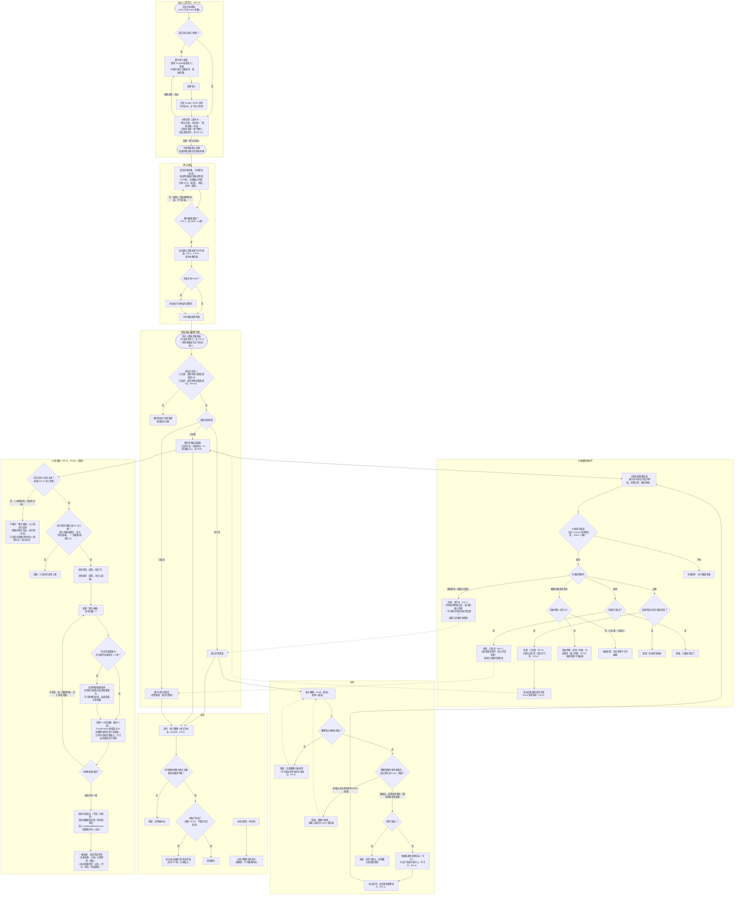
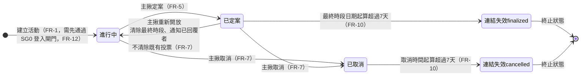

# 揪甘心 — 系統流程圖

本頁補充 [規格書.md](./規格書.md)、[PRD](../README.md) 的文字規格，用兩張圖呈現 Phase 1 的完整系統流程：第一張是「主站登入（FR-12）→ 主揪建立活動 → 參與者投票 → 主揪定案／取消／重新開放／編輯 → AI 選餐廳（FR-11）→ 留言」的完整流程與驗證關卡；第二張是活動狀態（進行中／已定案／已取消／連結失效）之間的轉換關係。圖中節點標註的 FR 編號對應 [規格書.md 第 4 節](./規格書.md#41-功能需求總表)的功能需求。這張圖是正式產品的目標流程，不是任何既有畫面的複製。

---

## 一、主流程圖

> 圖中實線箭頭為正向流程；虛線箭頭代表「重試」或「主揪操作後回到某畫面」的迴圈，非主要閱讀路徑。SG0（登入）只擋主站入口（無 `event` 參數的路由）；SG2～SG6（活動頁與其上的所有互動，含 AI 選餐廳結果本身的唯讀顯示）不受登入狀態影響，任何人都能直接開啟——這是 FR-12「參與者路由完全不受影響」的規則，優先權高於「主站需要登入」。

---

## 二、活動狀態轉換圖

**補充說明**：

- 「已取消」與「連結失效」都是終止狀態，但阻擋範圍不同——已取消只會阻擋新投票（見 FR-3），不會阻擋留言（見 FR-9）；連結失效則會阻擋所有互動（投票、留言、查看彙整，見 FR-10）
- 連結失效有**兩條獨立的判斷路徑**：已定案的活動以「最終時段日期」起算超過 7 天失效；已取消的活動以「取消時間」起算超過 7 天失效。「進行中」的活動不論多舊都不會因此失效
- 「重新開放」只能從「已定案」回到「進行中」，且不會清除參與者已送出的回覆內容；「已取消」是終止狀態，目前沒有任何路徑可以回到其他狀態
- **AI 選餐廳（FR-11）與登入／登出都不是這張圖的狀態轉換**：AI 選餐廳是「已定案」狀態內部的一個動作（選定餐廳只會寫入 `final_slot` 之外的欄位，不會觸發任何狀態變更，詳見上方主流程圖 SG6）；登入／登出只影響 SG0 這個路由層級的畫面切換，不會改變任何 `events` 資料表裡的 `status` 欄位

---

[回到 規格書.md](./規格書.md) ｜ [回到 PRD 索引](../README.md)
